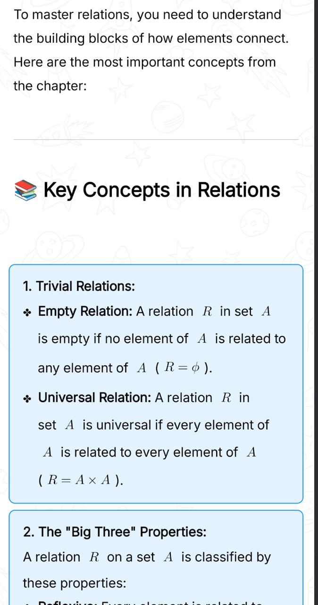
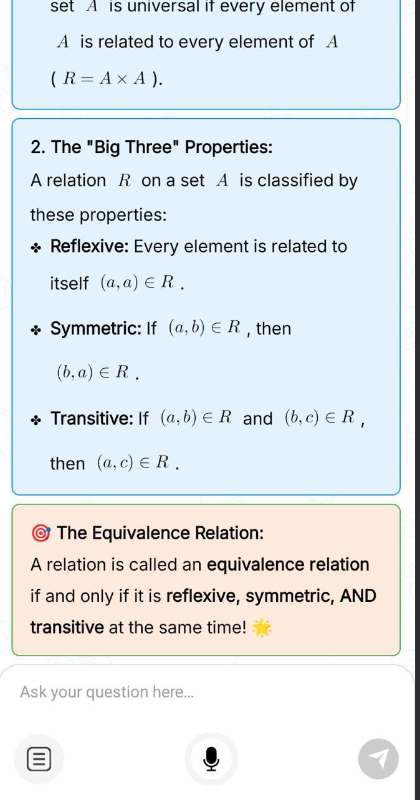

# StreamMark

**Streaming markdown for AI chat on Android Compose.**

StreamMark is a Jetpack Compose library that renders markdown while tokens stream in — built for AI chat UIs. It supports LaTeX, GFM tables and strikethrough, styled HTML boxes, images, and incremental parsing without waiting for the full response.

| | |
|---|---|
| **Package** | `io.edutor.streammark` |
| **Min SDK** | 24 |
| **Compile SDK** | 36 |
| **License** | [Apache 2.0](LICENSE) |

## Features

- Incremental parsing while `isStreaming = true`
- Inline and block LaTeX (JLatexMath)
- GFM tables and strikethrough (CommonMark)
- HTML boxes with inline CSS
- Images via Coil
- Custom `segmentRenderer` for app-specific segments (mindmap, charts, selection actions)
- Legacy Android `TextView` path (`MarkdownTextRenderer`, `MarkdownStyle`)
- Screenshots with default configurations:

<a href="./art/streammark-render-html-sample-1.jpeg">
  
</a>
<a href="./art/streammark-render-latex-sample-1.jpeg">
  
</a>
<a href="./art/streammark-render-latex-sample-2.jpeg">
  
</a>
<a href="./art/streammark-render-html-sample-2.jpeg">
  
</a>


## Requirements

Your app must already use **Jetpack Compose** and a **Compose BOM** aligned with your project. StreamMark does not pull in Material3 or Activity Compose — add those in your app as usual.

## Installation

Use it like **CommonMark** or **Coil** — add a version in `libs.versions.toml` and one `implementation` line.

**Maven coordinates:** `io.edutor:streammark:1.0.0`  
**Repository:** [GitHub Packages](https://github.com/jigar225/streammark/packages) (`jigar225/streammark`)

> GitHub Packages needs a **read token** to download (even for public repos). Put credentials in `~/.gradle/gradle.properties` once per machine (see below).

### 1. Repository — `settings.gradle.kts`

Inside `dependencyResolutionManagement { repositories { ... } }`:

```kotlin
maven {
    url = uri("https://maven.pkg.github.com/jigar225/streammark")
    credentials {
        username = providers.gradleProperty("gpr.user").get()
        password = providers.gradleProperty("gpr.key").get()
    }
}
```

In **`~/.gradle/gradle.properties`** (your Mac, not in the app repo):

```properties
gpr.user=YOUR_GITHUB_USERNAME
gpr.key=ghp_xxxx   # PAT with read:packages
```

### 2. Version catalog — `gradle/libs.versions.toml`

```toml
[versions]
streammark = "1.0.0"

[libraries]
streammark = { group = "io.edutor", name = "streammark", version.ref = "streammark" }
```

### 3. App module — `app/build.gradle.kts`

```kotlin
dependencies {
    implementation(libs.streammark)
    // Your app still needs Compose BOM + UI (StreamMark does not add Material3 for you)
    implementation(platform(libs.androidx.compose.bom))
    implementation(libs.androidx.material3)
}
```

**Without version catalog:**

```kotlin
implementation("io.edutor:streammark:1.0.0")
```

### Publish a new version (maintainers)

1. Create **`github.properties`** in project root (already in `.gitignore` — **never commit**):

```properties
gpr.user=YOUR_GITHUB_USERNAME
gpr.key=ghp_xxxx
```

Use a GitHub PAT with **write:packages**.

2. Bump `version` in `build.gradle.kts`  
3. Run:

```bash
./gradlew assembleRelease publishReleasePublicationToGitHubPackagesRepository
```

4. Git tag + push, e.g. `v1.0.1`

### Option B — Clone as Gradle module (contributors / offline)

```kotlin
// settings.gradle.kts
include(":streammark")
// point projectDir to cloned repo if needed

// app/build.gradle.kts
implementation(project(":streammark"))
```

## Quick start

```kotlin
import io.edutor.streammark.api.StreamMark
import io.edutor.streammark.api.StreamMarkConfig

@Composable
fun ChatMessage(text: String, stillStreaming: Boolean) {
    StreamMark(
        markdown = text,
        isStreaming = stillStreaming,
        config = StreamMarkConfig.Default,
    )
}
```

## Streaming

Pass `isStreaming = true` while the model is still generating. The parser reuses partial state so formatting stabilizes as new tokens arrive. Set `isStreaming = false` when the message is complete.

## Configuration

Use [`StreamMarkConfig`](src/main/java/io/edutor/streammark/api/StreamMarkConfig.kt) for sizes, colors, table styling, quote/hr appearance, and spacing.

```kotlin
StreamMark(
    markdown = text,
    isStreaming = false,
    config = StreamMarkConfig.Default.copy(plainTextSize = 16f),
)
```

`MarkdownRenderConfig` is a deprecated typealias — prefer `StreamMarkConfig` in new code.

## Custom segments

The default renderer covers text, LaTeX, tables, HTML boxes, and images. For mindmap/chart/mermaid blocks (or custom selection UI), provide `segmentRenderer`:

```kotlin
StreamMark(
    markdown = content,
    isStreaming = isStreaming,
    config = StreamMarkConfig.Default,
    segmentRenderer = { scope ->
        when (val segment = scope.segment) {
            is MessageContentSegment.VisualContentSegment -> {
                MyMindmapCard(segment, scope.modifier)
            }
            else -> ComposeMessageSegmentRenderer(
                segment = scope.segment,
                modifier = scope.modifier,
                enableLinks = scope.enableLinks,
                config = scope.config,
            )
        }
    },
)
```

Import `ComposeMessageSegmentRenderer` from `io.edutor.streammark.compose`.

## Public API

| API | Purpose |
|-----|---------|
| `StreamMark` | Main `@Composable` entry |
| `StreamMarkConfig` | Typography and colors |
| `StreamMarkSegmentScope` | Passed to custom `segmentRenderer` |
| `MessageContentSegment` | Parsed segment types |
| `MarkdownMapper` | Selection → raw markdown (Indic-script safe) |
| `EditableMarkdownRenderer` | Editable markdown field |
| `MarkdownStyle` / `MarkdownTextRenderer` | Legacy View rendering |

Internal packages (`parser`, `extraction`, `latex`, `spans`) are not guaranteed stable yet.

## Known limitations (v1.0.0)

- **`MarkdownHelper`** — stub only (plain text). Avoid for production rich text until replaced.
- **`VisualContentSegment`** — emitted by the parser; default renderer skips it. Use `segmentRenderer`.
- **ProGuard** — `consumer-rules.pro` is empty. Edutor ships without minify today; add keep rules if release shrinking breaks JLatexMath/CommonMark.

## Dependencies (transitive)

StreamMark bundles:

- AndroidX Core, AppCompat
- Compose UI (via BOM in your app)
- [CommonMark](https://github.com/commonmark/commonmark-java) + GFM tables & strikethrough
- [JLatexMath Android](https://github.com/noties/jlatexmath-android)
- [Coil](https://coil-kt.github.io/coil/) Compose

## Building

```bash
./gradlew assembleRelease
./gradlew publishReleasePublicationToMavenLocal   # optional
```

## Project layout

```
src/main/java/io/edutor/streammark/
├── api/       # StreamMark, StreamMarkConfig, segments
├── parser/    # HybridStreamingParser, MarkdownMapper
├── compose/   # Default segment renderers
├── extraction/
├── latex/
├── spans/
└── ui/        # Legacy View path
```

## Contributing

We welcome fixes and improvements. **Discuss larger changes before opening a PR** — see [CONTRIBUTING.md](CONTRIBUTING.md).

## Changelog

See [CHANGELOG.md](CHANGELOG.md).

## License

Apache License 2.0 — see [LICENSE](LICENSE).

Copyright © 2026 **Edutor**, **Jigar Joshi**, and **Vishal Trivedi**.
